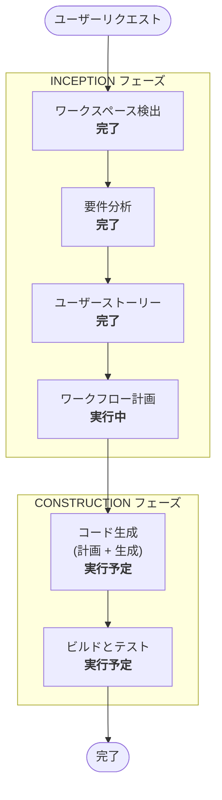

# 実行計画

## 詳細分析サマリ

### 変更影響評価
- **ユーザー向け変更**: あり — 新規の可視化ダッシュボード、発注提案承認、配送管理UI
- **構造変更**: あり — 新規システム全体のアーキテクチャ設計が必要
- **データモデル変更**: あり — 10テーブルの新規作成（店舗・食材・在庫・発注・配送・ドライバー・監査ログ・同意記録・ユーザーロールマッピング）
- **API変更**: なし — SiSアプリ内で完結（外部API不要）
- **NFR影響**: あり — パフォーマンス、セキュリティ、プライバシー、エラーハンドリング要件あり

### リスク評価
- **リスクレベル**: 中（Medium）
- **ロールバック複雑度**: 低（新規システムのため、デプロイしなければ影響なし）
- **テスト複雑度**: 中（Row Access Policy、Stored Procedure、SiS環境テストが必要）

---

## ワークフロー可視化

---

## 実行フェーズ

### INCEPTION フェーズ
- [x] ワークスペース検出（完了）
- [x] リバースエンジニアリング — スキップ（新規開発のため不要）
- [x] 要件分析（完了 — 9問 + 4追加質問）
- [x] ユーザーストーリー（完了 — 2ペルソナ、5エピック、12ストーリー）
- [x] ワークフロー計画（本ドキュメント）
- [ ] アプリケーション設計 — **スキップ**
  - **理由**: SiSアプリはStreamlit単一アプリ構成。サービスレイヤー分離やコンポーネント間依存はシンプル。Snowpark + Stored Procedureのパターンが要件定義で決定済みのため、別途のアプリケーション設計フェーズは不要
- [ ] ユニット生成 — **スキップ**
  - **理由**: エピック単位（Q7=A）のストーリーで十分。モジュール分割はコード生成計画（Part 1）で対応可能

### CONSTRUCTION フェーズ
- [ ] 機能設計 — **スキップ**
  - **理由**: ユーザーストーリーの受入基準（Given-When-Then）で機能仕様が十分に定義済み
- [ ] NFR要件 — **スキップ**
  - **理由**: requirements.mdのNFR-01〜27で包括的に定義済み。技術スタックも確定（Snowpark/SiS）
- [ ] NFR設計 — **スキップ**
  - **理由**: Section 3.3〜3.9でSiS制約、キャッシュ戦略、RBAC設計、Row Access Policy、Warehouse設定が設計済み
- [ ] インフラ設計 — **スキップ**
  - **理由**: Section 3.5〜3.8でWarehouse設定、RBAC、デプロイメント方針、環境分離が定義済み。CONSTRUCTION前提条件としてsetup.sql/GitHub Actionsも計画済み
- [ ] コード生成 — **実行**（必須）
  - **理由**: アプリケーションコードの実装が必要
  - **Part 1（計画）**: ファイル構成、モジュール分割、pyproject.toml、setup.sql、GitHub Actionsワークフロー定義
  - **Part 2（生成）**: Streamlitアプリコード、Snowpark DAL、Stored Procedure、テストコード
- [ ] ビルドとテスト — **実行**（必須）
  - **理由**: ruff lint/format、pytest実行、SiS環境での動作確認が必要

---

## 実行サマリ

| ステージ | 判定 | 理由 |
|---------|------|------|
| ワークスペース検出 | 完了 | — |
| リバースエンジニアリング | スキップ | 新規開発 |
| 要件分析 | 完了 | — |
| ユーザーストーリー | 完了 | — |
| ワークフロー計画 | 完了 | 本ドキュメント |
| アプリケーション設計 | スキップ | SiS単一アプリ、設計済み |
| ユニット生成 | スキップ | エピック単位で十分 |
| 機能設計 | スキップ | 受入基準で定義済み |
| NFR要件 | スキップ | NFR-01〜27定義済み |
| NFR設計 | スキップ | Section 3.3〜3.9設計済み |
| インフラ設計 | スキップ | Section 3.5〜3.8定義済み |
| **コード生成** | **実行** | アプリ実装が必要 |
| **ビルドとテスト** | **実行** | 品質検証が必要 |

**合計実行ステージ**: 2（コード生成、ビルドとテスト）
**スキップステージ**: 6（リバースエンジニアリング、アプリケーション設計、ユニット生成、機能設計、NFR要件/設計、インフラ設計）

---

## コード生成 Part 1（計画）成果物チェックリスト

Part 1完了時に以下が全て揃っていることを検証してからPart 2に進む:

- [x] **pyproject.toml** — 作成済み（開発依存/SiS依存分離、ruff/pytest/coverage設定含む）
- [x] **setup.sql** — 作成済み（Warehouse/DB/Schema/Role/RAP/Resource Monitor/Tasks/Time Travel）
- [x] **GitHub Actionsワークフロー** — 作成済み（lint/test/deploy-stg/deploy-prodの4ジョブ）
- [x] **ファイル構成・モジュール分割** — 作成済み（DAL層/UI層/バリデーション/定数の分離）
- [x] **Stored Procedure一覧** — 作成済み（5SP: 承認/却下/配送完了/提案生成/データ保持管理）
- [x] **画面構成定義** — 作成済み（店長3画面+ドライバー1画面+同意画面のワイヤーフレーム）

## 成功基準
- **主目標**: ラーメンチェーン店の食材在庫管理・発注提案・配送管理のSiSアプリを構築
- **主な成果物**:
  - Streamlit in Snowflakeアプリケーション（店長画面 + ドライバー画面）
  - Snowflakeインフラ設定スクリプト（Warehouse、Role、Row Access Policy、Stored Procedure、Tasks）
  - テストコード（pytest、ビジネスロジック80%以上、セキュリティ関連100%）
  - CI/CDパイプライン（GitHub Actions）
- **品質ゲート**:
  - ruff lint/format 通過
  - pytest 全テスト通過（カバレッジ閾値クリア）
  - `/review` による全専門家90点以上
