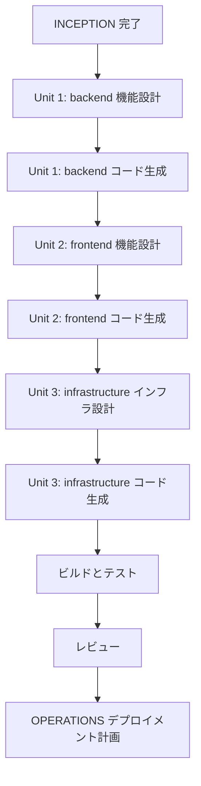

# 実行計画（v2 — 移行プロジェクト）

## プロジェクト概要
Streamlit → React (TS) + FastAPI + Snowflake Container Services 移行

## フェーズ・ステージ決定

### INCEPTION フェーズ
| ステージ | 決定 | 根拠 |
|---|---|---|
| ワークスペース検出 | ✅ 実行済 | Brownfield 移行 |
| リバースエンジニアリング | ✅ 実行済 | 既存コードの構造把握 |
| 要件分析 | ✅ 実行済 | 移行固有要件の整理（9問回答済み） |
| ユーザーストーリー | ⏭ SKIP | v1 のストーリー（12件）が有効。移行は技術変更であり、ユーザー要件は同一 |
| アプリケーション設計 | ⏭ SKIP | 要件定義書のアーキテクチャ決定で十分。ユニット生成で具体化 |
| ユニット生成 | ✅ EXECUTE | frontend/backend/docker の3ユニットに分割 |
| ワークフロー計画 | ✅ EXECUTE（本ドキュメント） | — |

### CONSTRUCTION フェーズ
| ステージ | 決定 | 根拠 |
|---|---|---|
| 機能設計 | ✅ EXECUTE | React コンポーネント設計、API エンドポイント設計が必要 |
| NFR 要件 | ⏭ SKIP | 要件定義書 NFR セクションで網羅済み |
| NFR 設計 | ⏭ SKIP | 1コンテナ構成でシンプル、特別なパターン不要 |
| インフラ設計 | ✅ EXECUTE | Container Services spec.yml、Dockerfile、Nginx 設定が必要 |
| コード生成 | ✅ EXECUTE | Part 1（計画）+ Part 2（生成） |
| ビルドとテスト | ✅ EXECUTE | Vitest + pytest + PBT |

### OPERATIONS フェーズ
| ステージ | 決定 | 根拠 |
|---|---|---|
| デプロイメント計画 | ✅ EXECUTE | CI/CD を Container Services 用に更新 |

---

## ユニット定義

### Unit 1: backend（FastAPI バックエンド）
- **スコープ**: FastAPI アプリ、API ルーター、認証ミドルウェア、Pydantic スキーマ
- **依存**: src/dal/（流用）、src/utils/（流用）
- **成果物**: backend/ ディレクトリ一式
- **優先度**: 最高（API が frontend の前提）

### Unit 2: frontend（React フロントエンド）
- **スコープ**: React + MUI、ページ、認証（MSAL.js）、API クライアント
- **依存**: Unit 1（API エンドポイント定義）
- **成果物**: frontend/ ディレクトリ一式
- **優先度**: 高

### Unit 3: infrastructure（コンテナ・デプロイ）
- **スコープ**: Dockerfile、nginx.conf、spec.yml、CI/CD 更新
- **依存**: Unit 1 + Unit 2
- **成果物**: docker/、spec.yml、CI/CD 設定
- **優先度**: 中（コード完成後）

---

## 実行順序フロー

---

## リスク評価

| リスク | 重大度 | 対策 |
|---|---|---|
| RLS → アプリ層制御への移行でデータ漏洩 | High | 全APIエンドポイントにロールフィルタテスト追加 |
| Azure AD テナント未準備 | Medium | モック認証で開発、後からテナント情報差し込み |
| 1コンテナのリソース制約 | Medium | Container Services のリソース設定で調整可能 |
| DAL 流用時の Streamlit 依存 | Low | st.cache_data 参照を検出・除去 |

---

## 完了基準
- [ ] 全 API エンドポイントが動作すること
- [ ] React UI で全 CRUD 操作が可能なこと
- [ ] Azure AD SSO でログイン〜ロール判定が動作すること
- [ ] ロールベースフィルタリングが正しく動作すること（旧 RLS 相当）
- [ ] Docker コンテナがビルド・起動できること
- [ ] テストカバレッジ 80% 以上
- [ ] 既存の監査ログ機能が維持されること
